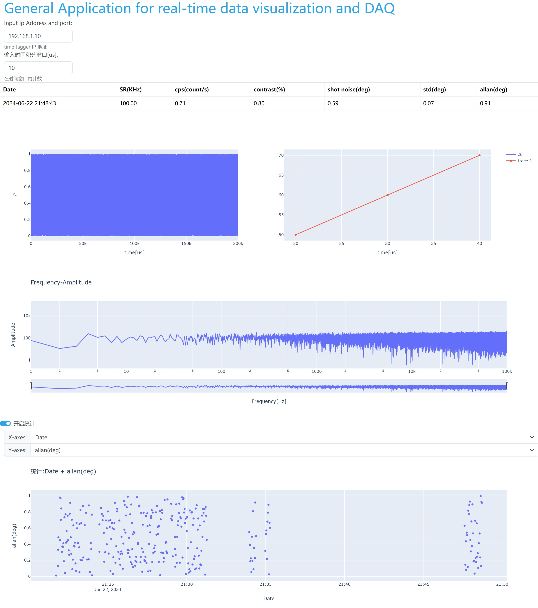

# 基于Dash的实时数据显示(Real-time data visualization and DAQ simple demo)

Created: June 21, 2024 9:47 PM
Last Edited Time: June 22, 2024 10:03 PM


> 前言（目的）：构建一个简单的数据实时显示框架，方便以后使用。

将仪器的数据（可以是示波器或者某个端口的数据）以期望的方式显示在网页端，并具备一定简单处理与统计功能。

### 安装

python环境已经以下的库

```bash
pip install dash dash-DAQ dash-bootstrap-components plotly numpy pandas TinyDB
```

**运行**

```bash
python3 app.py
```

在浏览器打开 [http://127.0.0.1:8050/](http://127.0.0.1:8050/)。成功运行后如下图



网页效果

## About

前后端主要基于之前比较熟悉的Dash构建，统计实验数据并存储在轻量级数据库TinyDB中。

### 前端设计

最初前端设计分为两部分。由左边的参数输入区域和右边的可视化区域构成。设计初稿见下图。


前端的最开始构思的时候，现有采用最常见的左边菜单加右边主视图布局，最后发现左边菜单需要输入的参数太少了，导致左边菜单的利用率并不高（~~并不是刚开始Row的宽度设为`Auto` ，导致Row显示的像是Column堆叠在一起，觉得效果还不错~~）。

`left-column` :左边菜单栏作为信息显示与输入端；

`right-column` :右边为主视图，大致分为两部分。实时结果显示与统计趋势；

- `r_c_row1,r_c_row2` ：实时的结果显示。
  - `r_c_row1` 以Table呈现出我们实验中所关注的值；
  - `r_c_row2` 以Figure的形式呈现实时数据，初期期望呈现出时域与频域的信息；
- `r_c_row3` ：统计实验中所关注值，以可视化的形式呈现出关注值随时间或多个关注值的相对关系。

### 后端设计

作为一个简单的主要基于Dash的小程序，数据的实时获取与处理主要基于Dash的`interval` 类，类似于一个按特定时间周期运行的计数器，加上`callback` 可以周期调用特定函数，从而实现**类**实时效果的批处理（注意由于`interval` 的最短周期为1ms在长的时间跨度是可以看作像是实时数据一样，如果想要实现真正的实时效果，可以参考stream（流数据）的资料。）。

后端处理也可以按前端的**实时结果显示**与**统计趋势**分类。

`Extend_real_time_graph()` ：与`r_c_row1,r_c_row2`对应，为实时数据获取于处理函数，流程可以分为：

获取数据、处理、推送关注值到本地数据库、实时数据可视化。

数据库以`dataBase%Y-%m-%d-%Hh.json` 文件保存在本地，可以用TinyDB库读取。

`Extend_static_graph()、Updated_row3_1_graph_xy()` : 与`r_c_row3` 对应，控制这统计开关与所关注的物理量，从数据库拉取对应数据并可视化显示；

## 结语

从开始构思到有了简易的雏形，差不多用了一个周末的时间，可能有些功能或者问题没有考虑到，这会在后续更新。

第一次上手了一个简单的数据库，可能用法比较简单粗暴，但也实现了预期的功能，不过有时会有BUG :-( 。希望后面可以作为一个简单的app，直接从数据库拉取，实验端本地处理完（比如可以用Red pitaya处理）之后直接将关注值和实验数据(文件名)直接推送到数据库上，构建一个中心化的实验室 🌀。
